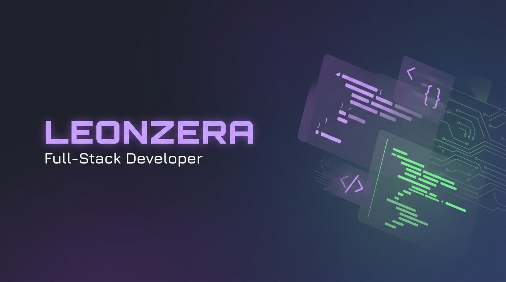
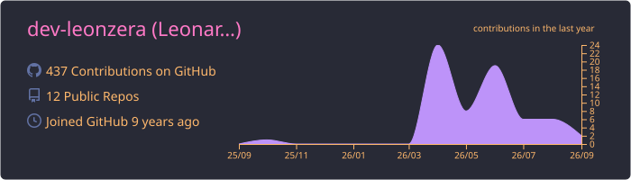
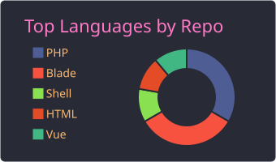
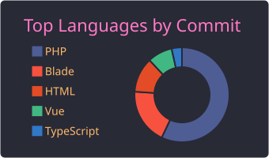
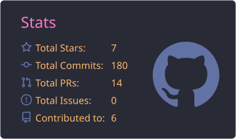
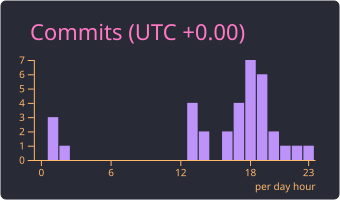

  

---

## 🧑‍💻 Sobre Mim

Sou **Leonardo "Leonzera" Andrade**, desenvolvedor full-stack formado em **Desenvolvimento Back-End** e pós-graduado em **Arquitetura de Soluções**, com **MBA em Gestão de Projetos e Processos de TI** pela Anhanguera 🧡

Atualmente focado em **IA, RAG e LLMs**, explorando como essas tecnologias podem transformar produtos digitais. Busco oportunidades onde eu possa aplicar minha experiência técnica para construir soluções robustas e escaláveis.

> 💡 *Interessado em trabalhar comigo? Me mande um [email](mailto:[EMAIL_ADDRESS]) AGORA!*

Quando não estou codando, me encontra tocando guitarra 🎸, na academia 🏋️, curtindo o mar 🌊 ou planejando a próxima viagem ✈️

---

## 🛠️ Tech Stack

---

## 📊 GitHub Stats

  

  
  

  
  

---

## 🐍 Contribuições

  <picture>
    <source media="(prefers-color-scheme: dark)" srcset="https://github.com/dev-leonzera/dev-leonzera/blob/output/github-contribution-grid-snake-dark.svg" />
    <source media="(prefers-color-scheme: light)" srcset="https://github.com/dev-leonzera/dev-leonzera/blob/output/github-contribution-grid-snake.svg" />
    
  </picture>

---

<!-- ## 🚀 Projetos em Destaque

  
  

--- -->

## 🌐 Conecte-se comigo

  
  
  <!--  -->

 

  

 

  

---

  Feito com ☕ e 💪 por <strong>Leonzera</strong>

